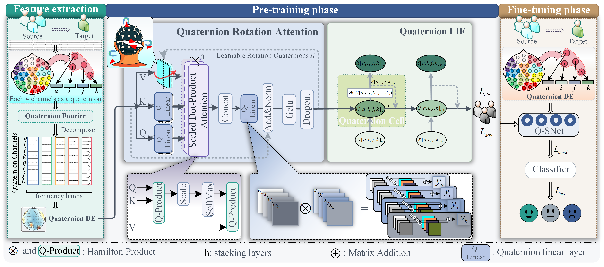
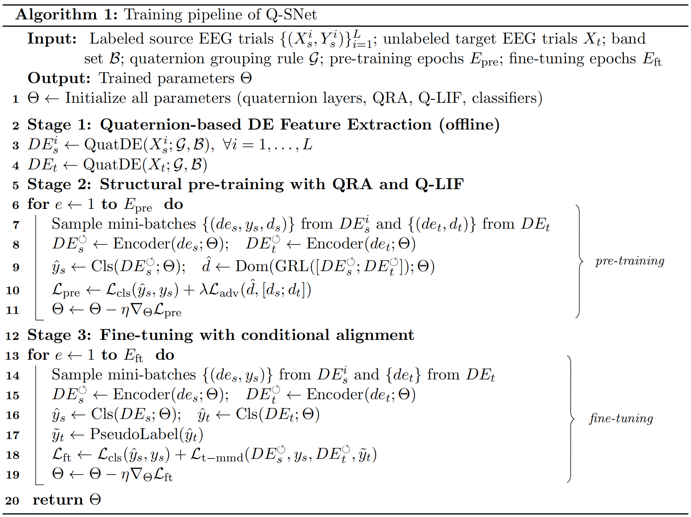
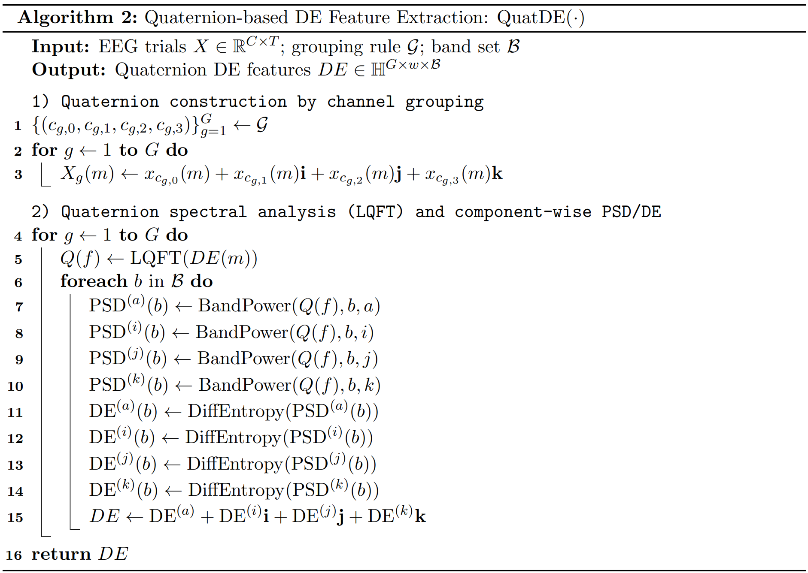
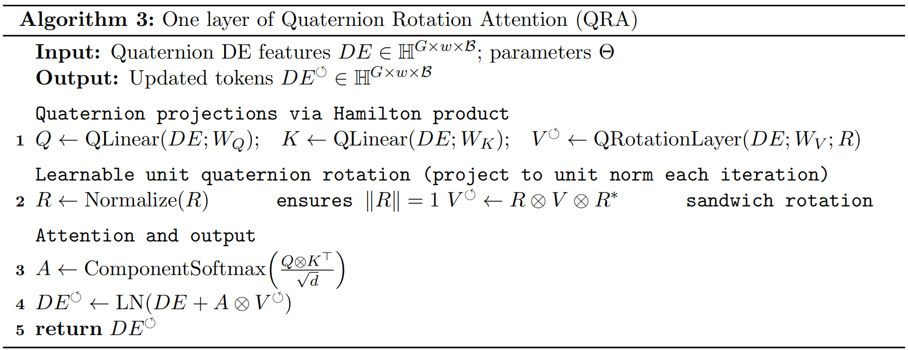
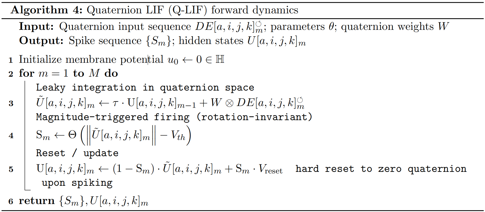

<h1 align="center">Q-SNet</h1>

<h3 align="center">
Quaternion Spiking Attention Network for Cross-Subject EEG Emotion Recognition
</h3>

<p align="center">
  <b>Quaternion representation · Rotation attention · Magnitude-triggered spiking · Cross-subject EEG</b>
</p>

<p align="center">
  
  
  
  
  
</p>

<p align="center">
  
</p>

<p align="center">
  <sub><b>Figure 1.</b> Overview of Q-SNet. EEG channels are grouped into quaternion representations, processed by quaternion rotation attention, and passed through magnitude-triggered Q-LIF neurons for robust cross-subject emotion recognition.</sub>
</p>

---

## 🔎 At a Glance

Q-SNet is a quaternion-based spiking framework for cross-subject EEG emotion recognition. It is designed for the setting where labeled EEG trials are available from source subjects, while the target subject is unlabeled during training.

The method addresses three issues in cross-subject EEG decoding:

<table>
<tr>
<td width="33%" align="center"><b>🧠 Multi-channel coupling</b></td>
<td width="33%" align="center"><b>🧭 Subject shift</b></td>
<td width="33%" align="center"><b>⚡ Spiking robustness</b></td>
</tr>
<tr>
<td align="center"><sub>Spatially related EEG channels are packed into quaternion components instead of being treated as independent scalar signals.</sub></td>
<td align="center"><sub>Learnable quaternion rotation is used in the attention value branch to model feature misalignment across subjects.</sub></td>
<td align="center"><sub>Q-LIF fires according to quaternion magnitude, enabling rotation-invariant spike triggering.</sub></td>
</tr>
</table>

---

## ✨ Main Contributions

- **Quaternion EEG representation.** Region-aware EEG channel groups are encoded as quaternion-valued signals to explicitly couple related multi-channel activity.

- **Quaternion Rotation Attention (QRA).** Learnable quaternion rotations are introduced into the attention module to improve feature alignment under subject-dependent shifts.

- **Quaternion LIF neuron (Q-LIF).** Spike firing is triggered by quaternion magnitude rather than scalar membrane potential, leading to rotation-invariant spiking dynamics.

- **Strong cross-subject performance.** Q-SNet achieves consistent gains on SEED, SEED-IV, and SEED-V under leave-one-subject-out cross-validation.

---

## 🧩 Method Overview

Q-SNet follows a three-stage pipeline.

<p align="center">
  
</p>

<p align="center">
  <sub><b>Algorithm 1.</b> Training pipeline of Q-SNet.</sub>
</p>

<table>
<tr>
<td width="30%" align="center"><b>Stage 1</b></td>
<td width="35%" align="center"><b>Stage 2</b></td>
<td width="35%" align="center"><b>Stage 3</b></td>
</tr>
<tr>
<td align="center"><sub><b>Quaternion DE extraction</b><br>Source and target EEG trials are transformed into quaternion differential entropy features.</sub></td>
<td align="center"><sub><b>Structural pre-training</b><br>QRA and Q-LIF are optimized with source classification and adversarial domain learning.</sub></td>
<td align="center"><sub><b>Conditional fine-tuning</b><br>Target pseudo-labels are used for class-wise source-target alignment.</sub></td>
</tr>
</table>

---

## 🧮 Algorithm Details

<details open>
<summary><b>Algorithm 2: Quaternion-based DE Feature Extraction</b></summary>

<p align="center">
  
</p>

This stage groups EEG channels into quaternion representations, applies quaternion spectral analysis, and extracts component-wise differential entropy features.
</details>

<details open>
<summary><b>Algorithm 3: Quaternion Rotation Attention</b></summary>

<p align="center">
  
</p>

QRA replaces real-valued projections with quaternion projections and rotates the value component using a learnable unit quaternion:

<p align="center">
  <code>V_rot = R ⊗ V ⊗ R*</code>
</p>

where <code>⊗</code> denotes the Hamilton product.
</details>

<details open>
<summary><b>Algorithm 4: Quaternion LIF Dynamics</b></summary>

<p align="center">
  
</p>

Q-LIF integrates quaternion-valued membrane states and triggers spikes according to quaternion magnitude:

<p align="center">
  <code>S = Θ(||U|| − V_th)</code>
</p>

This magnitude-triggered mechanism is invariant to unit-quaternion rotations.
</details>

---

## 📊 Main Results

All results are reported under leave-one-subject-out cross-validation. One subject is used as the target domain, and the remaining subjects are used as source domains.

<table>
<thead>
<tr>
<th align="center"><sub>Dataset</sub></th>
<th align="center"><sub>Classes</sub></th>
<th align="center"><sub>Accuracy (%)</sub></th>
<th align="center"><sub>F1 (%)</sub></th>
<th align="center"><sub>AUC (%)</sub></th>
</tr>
</thead>
<tbody>
<tr>
<td align="center"><sub>SEED</sub></td>
<td align="center"><sub>3</sub></td>
<td align="center"><sub><b>93.76 ± 5.08</b></sub></td>
<td align="center"><sub><b>93.73 ± 5.13</b></sub></td>
<td align="center"><sub><b>94.32 ± 3.81</b></sub></td>
</tr>
<tr>
<td align="center"><sub>SEED-IV</sub></td>
<td align="center"><sub>4</sub></td>
<td align="center"><sub><b>78.25 ± 10.89</b></sub></td>
<td align="center"><sub><b>76.31 ± 11.82</b></sub></td>
<td align="center"><sub><b>85.60 ± 7.59</b></sub></td>
</tr>
<tr>
<td align="center"><sub>SEED-V</sub></td>
<td align="center"><sub>5</sub></td>
<td align="center"><sub><b>89.98 ± 11.80</b></sub></td>
<td align="center"><sub><b>89.53 ± 12.57</b></sub></td>
<td align="center"><sub><b>93.68 ± 7.48</b></sub></td>
</tr>
</tbody>
</table>

### Improvement over the strongest prior baseline

<table>
<thead>
<tr>
<th align="center"><sub>Dataset</sub></th>
<th align="center"><sub>Previous Best Acc. (%)</sub></th>
<th align="center"><sub>Q-SNet Acc. (%)</sub></th>
<th align="center"><sub>Gain</sub></th>
</tr>
</thead>
<tbody>
<tr>
<td align="center"><sub>SEED</sub></td>
<td align="center"><sub>92.59</sub></td>
<td align="center"><sub><b>93.76</b></sub></td>
<td align="center"><sub><b>+1.17</b></sub></td>
</tr>
<tr>
<td align="center"><sub>SEED-IV</sub></td>
<td align="center"><sub>76.52</sub></td>
<td align="center"><sub><b>78.25</b></sub></td>
<td align="center"><sub><b>+1.73</b></sub></td>
</tr>
<tr>
<td align="center"><sub>SEED-V</sub></td>
<td align="center"><sub>80.21</sub></td>
<td align="center"><sub><b>89.98</b></sub></td>
<td align="center"><sub><b>+9.77</b></sub></td>
</tr>
</tbody>
</table>

---

## 🧪 Ablation and Analysis

<details open>
<summary><b>Component Ablation</b></summary>

<table>
<thead>
<tr>
<th align="center"><sub>Model Variant</sub></th>
<th align="center"><sub>SEED</sub></th>
<th align="center"><sub>SEED-IV</sub></th>
<th align="center"><sub>SEED-V</sub></th>
</tr>
</thead>
<tbody>
<tr>
<td><sub>w/o Quaternion Self-Attention</sub></td>
<td align="center"><sub>88.44 ± 6.42</sub></td>
<td align="center"><sub>66.16 ± 10.41</sub></td>
<td align="center"><sub>83.20 ± 12.44</sub></td>
</tr>
<tr>
<td><sub>w/o MMD</sub></td>
<td align="center"><sub>83.44 ± 8.69</sub></td>
<td align="center"><sub>69.77 ± 10.58</sub></td>
<td align="center"><sub>86.57 ± 10.87</sub></td>
</tr>
<tr>
<td><sub>w/o Quaternion LIF</sub></td>
<td align="center"><sub>88.63 ± 7.94</sub></td>
<td align="center"><sub>71.28 ± 12.30</sub></td>
<td align="center"><sub>83.25 ± 12.39</sub></td>
</tr>
<tr>
<td><sub><b>Q-SNet</b></sub></td>
<td align="center"><sub><b>93.76 ± 5.08</b></sub></td>
<td align="center"><sub><b>78.25 ± 10.89</b></sub></td>
<td align="center"><sub><b>89.98 ± 11.80</b></sub></td>
</tr>
</tbody>
</table>

The degradation caused by removing QRA, Q-LIF, or MMD indicates that the final performance is not produced by a single isolated module. Quaternion attention improves multi-channel representation, Q-LIF stabilizes spiking dynamics, and MMD contributes to source-target alignment.
</details>

<details>
<summary><b>Rotation Strategy</b></summary>

<table>
<thead>
<tr>
<th align="center"><sub>Rotation Strategy</sub></th>
<th align="center"><sub>SEED</sub></th>
<th align="center"><sub>SEED-IV</sub></th>
<th align="center"><sub>SEED-V</sub></th>
</tr>
</thead>
<tbody>
<tr>
<td><sub>X-axis</sub></td>
<td align="center"><sub>90.07</sub></td>
<td align="center"><sub>70.44</sub></td>
<td align="center"><sub>86.39</sub></td>
</tr>
<tr>
<td><sub>Y-axis</sub></td>
<td align="center"><sub>90.36</sub></td>
<td align="center"><sub>69.38</sub></td>
<td align="center"><sub>87.17</sub></td>
</tr>
<tr>
<td><sub>Z-axis</sub></td>
<td align="center"><sub>92.84</sub></td>
<td align="center"><sub>73.42</sub></td>
<td align="center"><sub>87.21</sub></td>
</tr>
<tr>
<td><sub><b>Learnable random-axis</b></sub></td>
<td align="center"><sub><b>93.76</b></sub></td>
<td align="center"><sub><b>78.25</b></sub></td>
<td align="center"><sub><b>89.98</b></sub></td>
</tr>
</tbody>
</table>

Learnable quaternion rotation consistently outperforms fixed-axis rotations, suggesting that the rotation axis should be optimized from data rather than manually predefined.
</details>

<details>
<summary><b>Channel Grouping Strategy</b></summary>

<table>
<thead>
<tr>
<th align="center"><sub>Grouping Strategy</sub></th>
<th align="center"><sub>SEED</sub></th>
<th align="center"><sub>SEED-IV</sub></th>
<th align="center"><sub>SEED-V</sub></th>
</tr>
</thead>
<tbody>
<tr>
<td><sub>Random grouping</sub></td>
<td align="center"><sub>90.07 ± 8.89</sub></td>
<td align="center"><sub>70.42 ± 15.17</sub></td>
<td align="center"><sub>82.33 ± 10.75</sub></td>
</tr>
<tr>
<td><sub>Original grouping</sub></td>
<td align="center"><sub>91.49 ± 6.72</sub></td>
<td align="center"><sub>77.88 ± 11.35</sub></td>
<td align="center"><sub>88.51 ± 12.39</sub></td>
</tr>
<tr>
<td><sub><b>Region-aware grouping</b></sub></td>
<td align="center"><sub><b>93.76 ± 5.08</b></sub></td>
<td align="center"><sub><b>78.25 ± 10.89</b></sub></td>
<td align="center"><sub><b>89.98 ± 11.80</b></sub></td>
</tr>
</tbody>
</table>

Region-aware grouping achieves the best performance, indicating that physiologically meaningful channel organization improves quaternion-based EEG representation learning.
</details>

---

## 🗺️ Feature Distribution Visualization

<p align="center">
  
</p>

<p align="center">
  <sub><b>Figure 2.</b> t-SNE visualization from raw EEG signals to quaternion DE features, after pre-training, and after fine-tuning.</sub>
</p>

The visualization shows a clear evolution of feature geometry. Raw EEG samples are highly mixed across subjects and emotion categories. After quaternion DE extraction and pre-training, the distribution becomes more structured. After fine-tuning, samples from the same emotion category form clearer clusters, and the source-target overlap improves.

---
## 📁 Repository Layout

The current repository is organized by dataset-specific reproducibility folders.

```text
Q-SNet/
├── seed-9376/                 # SEED experiment folder, reported Acc. = 93.76%
├── seed-iv-78.25/             # SEED-IV experiment folder, reported Acc. = 78.25%
├── seed-v-89.98/              # SEED-V experiment folder, reported Acc. = 89.98%
├── README.md
├── fig1.png
├── fig3_algorithm_training.png
├── fig4_algorithm_quatde.png
├── fig5.png
├── fig5_algorithm_qra.png
└── fig6_algorithm_qlif.png
```

---

## Thanks

 🎉🎉🎉 I would like to thank [Huazhong Shu](https://ieeexplore.ieee.org/author/37287366300) for his improvements to my manuscript and providing guidance on quaternion theory.
 
 🎉🎉🎉 I would like to thank [Jean Louis Coatrieux](https://ieeexplore.ieee.org/author/37298707200) for his help with quaternion theory.
 
 🎉🎉🎉 I would like to thank [Regine Le Bouquin Jeannes](https://ieeexplore.ieee.org/author/37355517100), for her rigorous approach in formula derivation.
 

---


## Citation
Hope this code can be useful. I would appreciate you citing us in your paper. 😊

